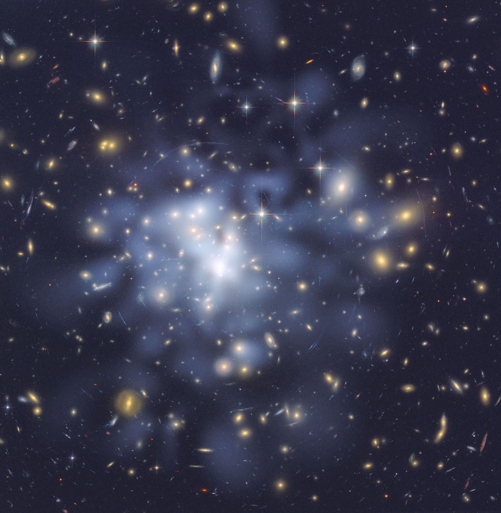
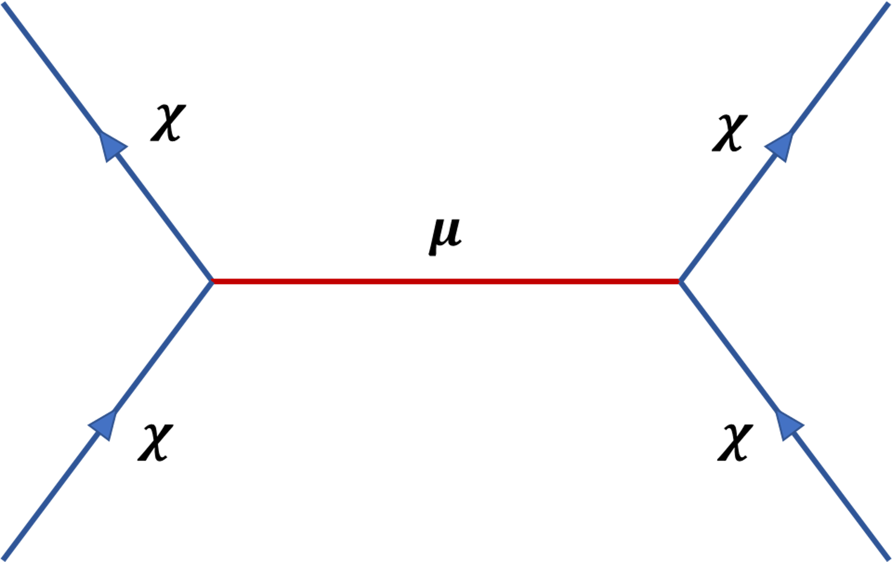
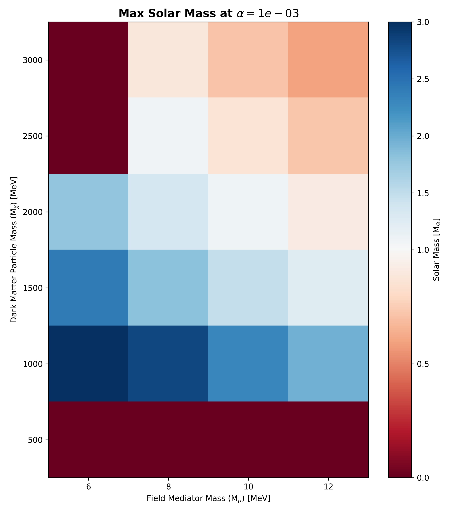
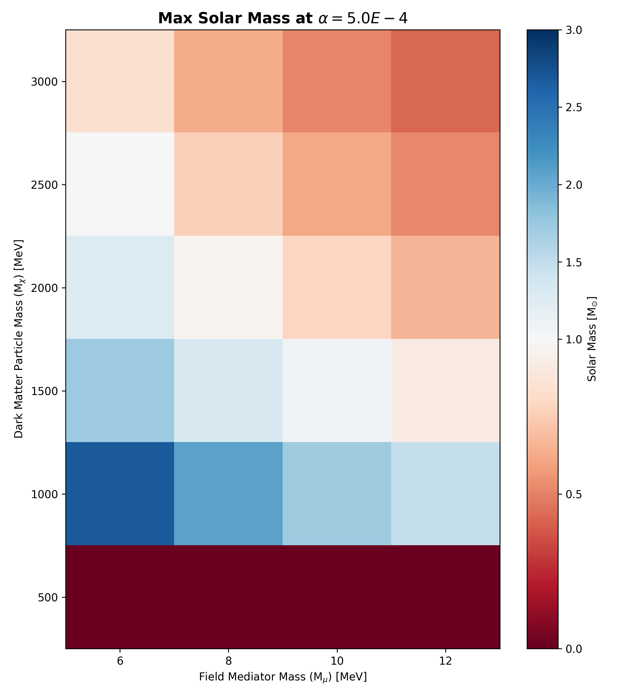
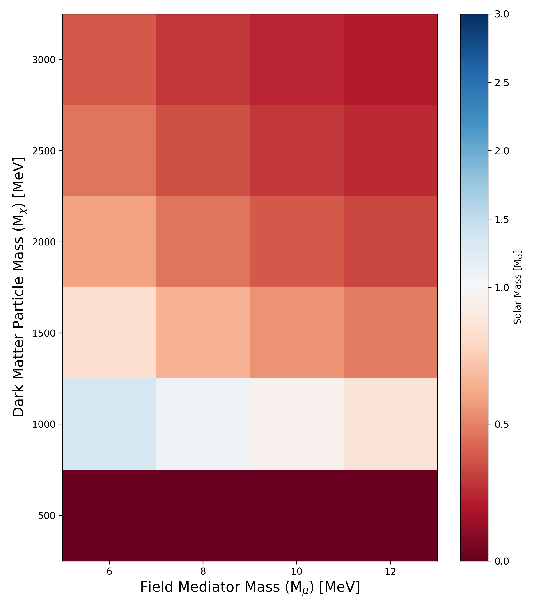

# Dark Star Modeling

Modeling Dark Matter clumping under various pressure and energy densities using the **Tolman-Oppenheimer-Volkoff equations**

$$\frac{dP}{dr} = - \left(\frac{Gm(r)\rho(r)}{r^{2} c^{2}}\right) \left(1 + \frac{P(r)}{\rho(r)} \right) \left(1 + \frac{4 \pi r^{3}P(r)}{m(r)} \right) \left(1 - \frac{2Gm(r)}{rc^{2}} \right)^{-1}$$

$$\frac{dM}{dr} = 4 \pi r^{2} \rho(r)$$

Started in 2022 under the guidance of Professor William Spinella

## Abstract
Dark matter is an unknown substance that accounts for most of the mass within the universe. Researchers try to understand the properties of dark matter and its interactions with other particles (Bahcall) <a href="https://www.pnas.org/doi/epdf/10.1073/pnas.1516944112" target="_blank">[1]</a>.

This study aims to reproduce the findings within “Asymmetric dark matter stars” (Kouvaris et al., 2015) <a href="https://doi.org/10.48550/arXiv.1507.00959" target="_blank">[2]</a> and "Dark stars: Gravitational and electromagnetic observables” (Maselli et al., 2017) <a href="https://doi.org/10.48550/arXiv.1704.07286" target="_blank">[3]</a> by constructing mass-radius relationships for dark matter clumping, or Dark Stars, and to further observe any trends that may occur from different parameters.

A theoretical model for Dark Stars was implemented, allowing the Tolman-Oppenheimer-Volkoff (TOV) equations to be solved and producing Dark Star mass-radius curves. Experimentation was done on parameter values and the resulting curves were compared to identify trends among different Dark Stars properties.

## Introduction
The information known about dark matter is detailed but quite sparse. For instance, the existence of dark matter particles is crucial to explain the high velocities of many galaxies and galaxy clusters, as the observable mass within them alone isn’t enough to maintain their velocities. As a result, it has been concluded that a majority of the mass within these galaxies and galaxy clusters is due to dark matter particles that interact weakly with other types of matter outside of gravitational interactions, making it difficult to directly detect dark matter. The current state of technology and experiments isn’t sufficient enough to directly detect dark matter, but it is possible to infer concentrations of dark matter.

Figure 1 is an image of galaxy cluster Abell 1698, which shows a distribution of Dark Matter concentrations produced by researchers at NASA. The tints of blue are the inferred Dark Matter concentrations within the galaxy cluster through gravitational lensing (NASA) <a href="https://science.nasa.gov/missions/hubble/detailed-dark-matter-map-yields-clues-to-galaxy-cluster-growth/" target="_blank">[4]</a>.

  
  
<strong>Figure 1:</strong> NASA, ESA, and D. Coe (JPL/Caltech and STScl) <a href="https://science.nasa.gov/asset/hubble/hubble-helps-astronomers-map-dark-matter-in-abell-1689/" target="_blank">[5]</a> 

With so much unknown about dark matter, large amounts of research is devoted to the study of dark matter and their characteristics. For instance, it has been theorized that the self-interactions of dark matter are purely gravitational, leading to the clumping of dark matter or the formation of Dark Stars. Research into the clumping of dark matter is usually referenced with the formation of Neutron Stars, which are composed primarily of neutrons and are the densest objects observable within the universe (NASA) <a href="https://imagine.gsfc.nasa.gov/science/objects/neutron_stars1.html" target="_blank">[6]</a>.

<!-- Information about the mass of newtrons is present here (https://physics.nist.gov/cgi-bin/cuu/Value?mnc2mev). From the National Institute of Standards and Technology (or NIST) -->
<!-- Maselli's Paper (https://doi.org/10.48550/arXiv.1704.07286) modeled with dark particle masses of 1 and 2 GeV [1,000 MeV and 2,000 MeV] (look at Figure 1's left graph)  -->
<!-- Kouvaris's Paper (https://doi.org/10.48550/arXiv.1507.00959) modeled with dark particle masses of 10 GeV, 100 GeV, and 1 TeV [10,000 MeV; 100,000 MeV; and 1,000,000 MeV] (look at Figure 3's graphs) -->
For comparison, neutrons have a mass of about $939.565 \, MeV$, while some studies have theorized and modeled dark matter with mass values between $1000 \text{ } MeV$ all the way to $1,000,000 \, MeV$ (NIST) <a href="https://physics.nist.gov/cgi-bin/cuu/Value?mnc2mev" target="_blank">[7]</a> (Kouvaris et al., 2015) <a href="https://doi.org/10.48550/arXiv.1507.00959" target="_blank">[2]</a> (Maselli et al., 2017) <a href="https://doi.org/10.48550/arXiv.1704.07286" target="_blank">[3]</a>. While these similarities aren’t perfect, Neutron Stars are the only observable objects that can be referenced because of their extreme density and resulting gravitational properties, characteristics uniquely shared with Dark Stars.

**Dark Matter Interactions**     \
Interactions between Dark Matter particles can depend on multiple variables:     
 - Dark Matter Particles ($\chi$) and their mass ($m_{\chi}$)
 - Field Mediators ($\mu$) and their mass ($m_{\mu}$)
 - Interaction Coupling Strength ($\alpha$)

## Methods / Results
In this study, dark matter self interactions are assumed to be repulsive and depend on multiple variables like the dark matter particles ($\chi$), field mediator ($\mu$), and interaction coupling strength ($\alpha$). Figure 2 is a Feynman diagram visualizing the self interactions between dark matter particles.

  
  
<strong>Figure 2:</strong> Feynman Diagram - Dark Matter Interaction

As the dark matter particles approach each other, the field mediator is an intermediary particle that passes the interaction coupling strength between the two dark matter particles. In a sense, the field mediator is a messenger particle “carrying” the interaction coupling strength, determining the type of interaction that occurs between the dark matter particles. However, the interaction isn’t completely dependent on the field mediator. 

Each of the variables affect the interaction in different ways. For the dark matter particles and field mediators, they affect the interaction through their masses, while the interaction coupling strength directly affects the interaction.

These variables are then applied to the following equations to calculate the repulsive Yukawa potential energy (1), kinetic pressure (2) and kinetic energy (3) values for dark matter clumping.

<!-- Equation 1 is from Equation 10 in the Kouvari's paper (https://doi.org/10.48550/arXiv.1507.00959) -->
$$
\begin{equation}
    \rho_{Yukawa} = \frac{g_{s}^{2} \alpha}{18 \pi^{3}} \frac{m_{\chi}^{3}}{\mu^{2}} x^{6} \tag{1}
\end{equation}
$$

<!-- Equation 2 is from Equation 5 in the Kouvari's paper (https://doi.org/10.48550/arXiv.1507.00959) -->
$$
\begin{equation}
    P_{kinetic} = \frac{g_{s}}{2} m_{\chi}^{4} \psi(x) \tag{2}
\end{equation}
$$

<!-- Equation 3 is from Equation 4 in the Kouvari's paper (https://doi.org/10.48550/arXiv.1507.00959) -->
$$
\begin{equation}
    \rho_{kinetic} = \frac{g_{s}}{2} m_{\chi}^{4} \xi(x) \tag{3}
\end{equation}
$$

In equation (1), the x variable is a measure of how relativistic a particle is, or how much their behavior is influenced by the principles of Einstein’s theory of relativity (Kouvaris et al., 2015) <a href="https://doi.org/10.48550/arXiv.1507.00959" target="_blank">[2]</a>. Non-relativistic particles move much slower than the speed of light, and can be described using classical physics. While relativistic particles move significant fractions of the speed of light, and can only be described using the laws of relativity. The general ranges of x and their meaning are as follows:
- $x = 0 \, \qquad$            [particle is at rest]
- $x > 1 \, \qquad$            [particle is non-relativistic, moving at slow speeds]
- $x \approx 1 \, \qquad$      [particle is relativistic, moving at significant fractions of the speed of light]
- $x \gg 1 \qquad$          [particle is highly relativistic, moving close to the speed of light]

Within this study, the relativistic parameter was kept to a range of 0 to 1, testing particles that are non-relativistic and relativistic. Additionally, the $\xi(x)$ and $\psi(x)$ equations within the Kinetic Pressure and Kinetic Energy equations were provided in “Asymmetric dark matter stars,” and are the following equations below (Kouvaris et al., 2015) <a href="https://doi.org/10.48550/arXiv.1507.00959" target="_blank">[2]</a>.

<!-- Equation 4 is from Equation 6 in the Kouvari's paper (https://doi.org/10.48550/arXiv.1507.00959) -->
$$
\begin{equation}
    \xi(x) = \frac{1}{8 \pi^{2}} \left[x \sqrt{1 + x^{2}} (1 + 2x^{2}) - ln\left(x + \sqrt{1 + x^{2}}\right) \right] \tag{4}
\end{equation}
$$

<!-- Equation 5 is from Equation 7 in the Kouvari's paper (https://doi.org/10.48550/arXiv.1507.00959) -->
$$
\begin{equation}
    \psi(x) = \frac{1}{8 \pi^{2}} \left[x \sqrt{1 + x^{2}} (\frac{2 x^{2}}{3} - 1) + ln\left(x + \sqrt{1 + x^{2}}\right) \right] \tag{5}
\end{equation}
$$

After these values are calculated, they are then summed up to determine the total pressure and energy density for dark matter clumping.

<!-- Equation 6 is from Equation 11 in the Kouvari's paper (https://doi.org/10.48550/arXiv.1507.00959) -->
$$
\begin{equation}
    P_{total} = P_{kinetic} + \rho_{Yukawa} \notag
\end{equation}
$$

$$
\begin{equation}
    P_{total} = \frac{g_{s}}{2} m_{\chi}^{4} \psi(x) + \frac{g_{s}^{2} \alpha}{18 \pi^{3}} \frac{m_{\chi}^{3}}{\mu^{2}} x^{6} \tag{6}
\end{equation}
$$

<!-- Equation 7 is from Equation 12 in the Kouvari's paper (https://doi.org/10.48550/arXiv.1507.00959) -->
$$
\begin{equation}
    \rho_{total} = \rho_{kinetic} + \rho_{Yukawa} \notag
\end{equation}
$$

$$
\begin{equation}
    \rho_{total} = \frac{g_{s}}{2} m_{\chi}^{4} \xi(x) + \frac{g_{s}^{2} \alpha}{18 \pi^{3}} \frac{m_{\chi}^{3}}{\mu^{2}} x^{6} \tag{7}
\end{equation}
$$

With these values calculated, an equation of state has been established for dark matter clumping, which describes the relationship between the pressure density and energy density of dark matter. An example graph of the pressure density and energy density with the following parameters: 

$$m_{\chi} = 1000 \: MeV / c^{2} \qquad m_{\mu} = 10 \, MeV / c^{2} \qquad \alpha = 10^{-3}$$

  
  
<strong>Figure 3:</strong> Example Pressure and Energy Density Graph

With an array of corresponding pressure density and energy density values, the Tolman-Oppenheimer-Volkoff equations are solved numerically for each pair of density values. Where pairs of pressure density and energy density values are used as central density values to calculate the mass and radius for that Dark Star. Within the graph, the total masses are expressed as solar mass multiples, where one solar mass ($M_{\odot}$) is equal to $1.989 \times 10^{30} \, kg$. 

This process was repeated for multiple parameter combinations, iterating through the following values:
- Dark Matter Particle Mass: $[500, 1000, 1500, 2000, 2500, 3000] \, MeV$
- Field Mediator Mass: $[6, 8, 10, 12] \, MeV$
- Yukawa Interaction Coupling Strength: $[1 \times 10^{-3}, 5 \times 10^{-4}, 1 \times 10^{-4}]$

These values were chosen based on experimented values within "Dark stars: Gravitational and electromagnetic observables" and further expanded with intermediary values. The maximum Dark Star within each parameter combination was then compared using several heatmaps to identify any ponential trends with respect to changing parameter values. Below are the three different heat maps created using the parameters in this study, each representing a unique Yukawa Interaction Coupling Strength. 

  
  
<strong>Figure 4:</strong> Heat Map for the Maximum Dark Stars with a 1E-3 Yukawa Interaction Coupling Strength

  
  
<strong>Figure 5:</strong> Heat Map for the Maximum Dark Stars with a 5E-4 Yukawa Interaction Coupling Strength

  
  
<strong>Figure 6:</strong> Heat Map for the Maximum Dark Stars with a 1E-4 Yukawa Interaction Coupling Strength

<!-- Smallest observed Neutron Star has a mass of 0.93 +/- 0.12 solar masses (which put it between the range of 0.8 to 1.0 solar masses). This was stated in Lattimer's paper in section 3.3 The Minimum Neutron Star Mass (https://doi.org/10.48550/arXiv.1305.3510) -->
The heatmaps have a gradient that transitions from red to blue, as the Dark Star mass increases. Parameter combinations that are result in a red color mean that the Dark Star would have a maximum mass of 0.8 solar masses or less. This would indicate that the particular Dark Star is unsustainable, as observed Neutron star masses are not sustainable with less than 0.8 to 1.0 solar masses (Lattimer, 2013) <a href="https://doi.org/10.48550/arXiv.1305.3510" target="_blank">[8]</a>. The probable result of these parameter combinations would be a collapse in mass and a formation of a black hole. 

## Discussion
The results of this study were compared to the results of other research articles, specifically “Asymmetric dark matter stars” (Kouvaris et al., 2015) <a href="https://doi.org/10.48550/arXiv.1507.00959" target="_blank">[2]</a> and "Dark stars: Gravitational and electromagnetic observables” (Maselli et al., 2017) <a href="https://doi.org/10.48550/arXiv.1704.07286" target="_blank">[3]</a>. Similar results in the curve comparison of the same parameters, which are shown below in Figures (7, 8, 9), validate that the theoretical constructs were implemented appropriately. 

  
  
<strong>Figure 7:</strong> Parameter Curve Comparison at 1E-3 Yukawa Interaction Coupling Strength

  
  
<strong>Figure 8:</strong> Parameter Curve Comparison at 5E-4 Yukawa Interaction Coupling Strength

  
  
<strong>Figure 9:</strong> Parameter Curve Comparison at 1E-4 Yukawa Interaction Coupling Strength

 

## Future Directions

Future directions within this topic include but are not limited to: 
1. Refinement of Yukawa potential approximations
2. Extended parameters for ultra-relativistic particles
3. Connecting theoretical results to observed dark stars or dark matter clumping

Continued research would merge computational astrophysics and dark matter theory, making progress towards more robust and validated dark matter clumping models. 

## References 
1. Bahcall, Neta A. "Dark matter universe." Proceedings of the National Academy of Sciences, vol. 112, no. 40, 2015, pp. 12243 - 12245. <a href="https://www.pnas.org/doi/epdf/10.1073/pnas.1516944112" target="_blank">https://www.pnas.org/doi/epdf/10.1073/pnas.1516944112</a>

2. Kouvaris, Chris and Niklas Grønlund Nielsen. "Asymmetric dark matter stars." Physical Review D, vol. 92, no. 6, 2015. <a href="https://doi.org/10.48550/arXiv.1507.00959" target="_blank">https://doi.org/10.48550/arXiv.1507.00959</a>

3. Maselli, Andrea, et al. "Dark stars: Gravitational and electromagnetic observables." Physical Review D, vol. 96, no. 2, 2017. <a href="https://doi.org/10.48550/arXiv.1704.07286" target="_blank">https://doi.org/10.48550/arXiv.1704.07286</a>

4.  NASA, ESA, D. Coe (NASA Jet Propulsion Laboratory/California Institute of Technology, and Space Telescope Science Institute) *Detailed Dark Matter Map Yields Clues to Galaxy Cluster Growth*. <a href="https://science.nasa.gov/missions/hubble/detailed-dark-matter-map-yields-clues-to-galaxy-cluster-growth/" target="_blank">https://science.nasa.gov/missions/hubble/detailed-dark-matter-map-yields-clues-to-galaxy-cluster-growth/</a>

5. NASA, ESA, D. Coe (NASA Jet Propulsion Laboratory/California Institute of Technology, and Space Telescope Science Institute) *Hubble Helps Astronomers Map Dark Matter in Abell 1689*. <a href="https://science.nasa.gov/asset/hubble/hubble-helps-astronomers-map-dark-matter-in-abell-1689/" target="_blank">https://science.nasa.gov/asset/hubble/hubble-helps-astronomers-map-dark-matter-in-abell-1689/</a>

6. NASA *Neutron Stars*. <a href="https://imagine.gsfc.nasa.gov/science/objects/neutron_stars1.html" target="_blank">https://imagine.gsfc.nasa.gov/science/objects/neutron_stars1.html</a>

7. National Institute of Standards Technology <a href="https://physics.nist.gov/cgi-bin/cuu/Value?mnc2mev" target="_blank">https://physics.nist.gov/cgi-bin/cuu/Value?mnc2mev</a>

8. Lattimer, James M. "The Nuclear Equation of State and Neutron Star Mass." Annual Review of Nuclear and Particle Science, vol. 62, no. 1, 2013. <a href="https://doi.org/10.48550/arXiv.1305.3510" target="_blank">https://doi.org/10.48550/arXiv.1305.3510</a>